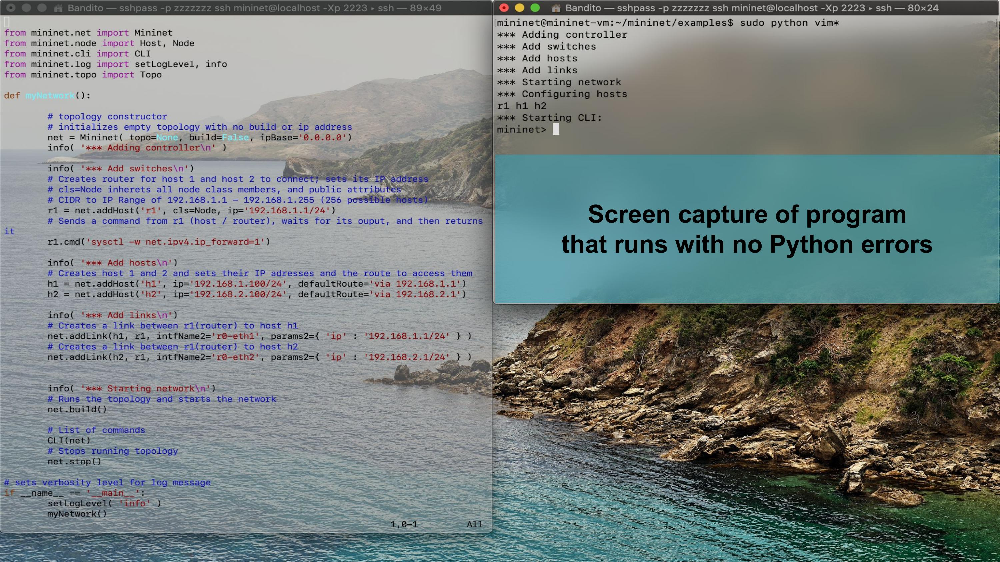
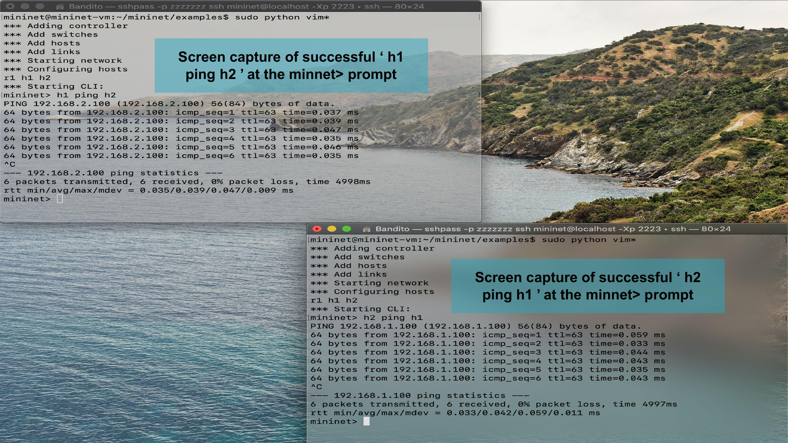

# Programming Assignment 4: Mininet Routers
## Overview
This assignment required us to start with Python code that built a 2 host network connected by a legacy router. We needed to modify it in order to allow the two hosts to send packets to each other. To accomplish this task we need to understand subnet addressing and the functions of a router.

## Objectives
* Showcase understanding of subnetting
* Showcase understanding of router function
* Showcase python code ability and documentation research
## To Run
Mininet is **REQUIRED** to run this
* Run using command `python3 im_legacy_router.py`
* Use XTerm to open two windows (one for each host)
* Run ping tests to each host

## Screenshots

## Authors and Roles
### Team 1
* Ricardo: Team Lead & Programmer
* Max: Programmer
### Team 2
* Lindsey: Diagram Designer & Programming Support
* Dan: Diagram Designer & Programming Support